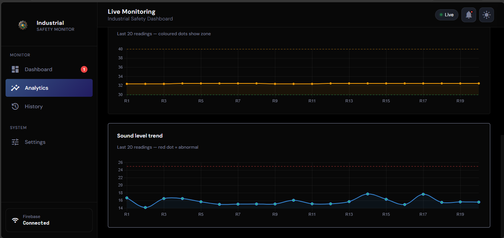
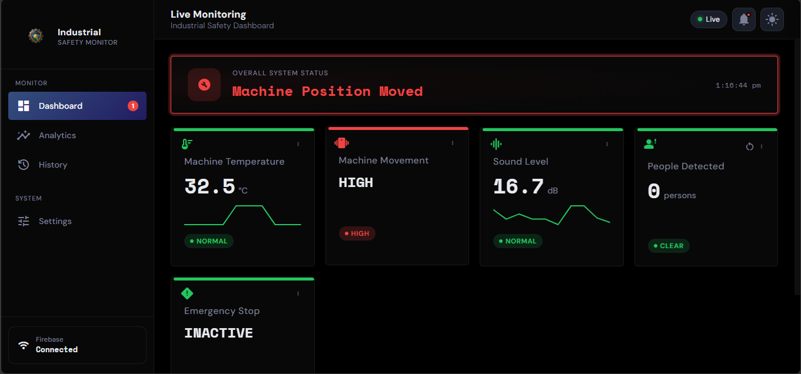

Risk Eye-🏭 Industrial Safety Monitoring System (IoT)

  Overview

The Industrial Safety Monitoring System is an IoT-based project built using ESP32 to monitor industrial environments in real-time.

It collects data from multiple sensors and detects unsafe conditions like high temperature, abnormal sound, or intrusion, and triggers alerts to prevent accidents.

Core Idea:
 Monitor → Analyze Risk → Trigger Safety Action

## ✨ Features

- 🌡️ Temperature Monitoring (DHT11)
- 🔊 Sound Level Detection (I2S Microphone)
- 📏 Machine Movement Detection (VL53L0X Sensor)
- 👤 Human Detection System (IR Sensor)
- 🚨 Emergency Stop (Push Button)
- 📡 Real-time Data via Firebase
- 📊 Live Monitoring Dashboard

## 🧠 Smart Safety Logic

- High Temperature + High Sound → Machine Failure Risk
- Machine Movement Detected → Safety Alert
- Human Detection → Danger Warning
- Button Press → Immediate Shutdown

System Flow:
Monitor → Analyze → Detect Risk → Trigger Alert

## 🏗️ Architecture

ESP32 collects data from sensors:
- DHT11 (Temperature)
- I2S Microphone (Sound)
- VL53L0X (Distance)
- Touch Sensor (Emergency)

⬇

Data sent to Firebase Realtime Database

⬇

Web Dashboard displays live data and alerts

## 📸 Dashboard Preview

